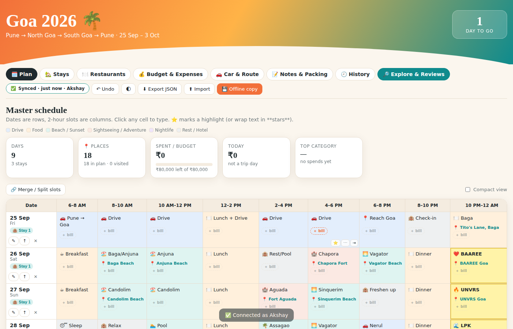
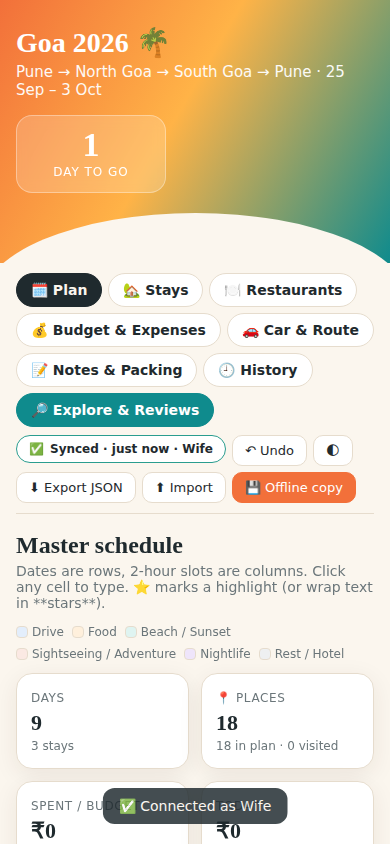
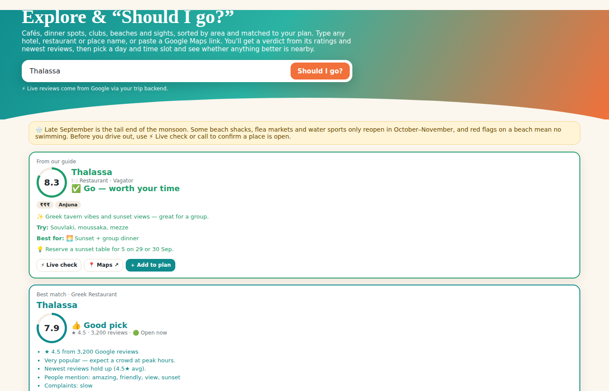

# 🌴 Goa Trip Planner

## 👉 Open the planner: **[https://akshaykangude.github.io/Goa_Trip_Planner/](https://akshaykangude.github.io/Goa_Trip_Planner/)**

| 🗓️ Trip planner | 🔎 Explore & "Should I go?" | 📱 Offline copy |
|---|---|---|
| [Open planner](https://akshaykangude.github.io/Goa_Trip_Planner/) | [Open Explore](https://akshaykangude.github.io/Goa_Trip_Planner/explore.html) | [Download offline file](https://github.com/akshaykangude/Goa_Trip_Planner/raw/main/offline/Goa-Trip-Planner-OFFLINE.html) |

Works on any phone or computer. Tap the link, pick your name, and enter the trip passcode. Then use **Add to Home Screen** so it opens like an app.

> 👉 **New here? Open [START-HERE.md](START-HERE.md)**. It covers the offline file (no setup) and the full online setup, step by step.

A shared, phone-friendly trip planner for **Goa · 25 Sep – 3 Oct 2026**.
Everyone in the group edits the same plan from their own phone. Bills, places and changes sync within about 30 seconds, and nothing is ever lost.

| Planner | On a phone | "Should I go?" search |
|---|---|---|
|  |  |  |

<sub>Screenshots come from the automated tests and use sample data, so the ratings shown are not real.</sub>

## What it does

**🗓️ Plan (`index.html`)**
- A day × 2-hour-slot table. Tap any slot to type in it, and **merge or split** slots (e.g. one long drive).
- Type a place (e.g. `🍽️ Lunch at Como Agua`) or **paste a Google Maps link** and its 📍 location appears under the slot.
- **＋ bill** under every slot: amount, *where / what* (required), and category. Each bill records who added it and when.
- A **💰 Spent** column per day, a spend-by-slot row, a day × category money table, and a *who owes whom* list.
- Stays, restaurants, budget, car/fuel/route, notes and a packing list.

**🔎 Explore & Reviews (`explore.html`)**
- A curated guide of about 60 cafés, restaurants, clubs, beaches and sights, sorted by area, each with a "worth your time" score.
- **Should I go?** Type any name **or paste a Google Maps link**. You get a 0–10 verdict built from the Google rating, the number of reviews and the newest reviews: what people love, what they complain about, and whether it's open now.
- **When do you want to go?** Pick the day and time slot. It then shows **better-rated options near you** (using your phone's location) and adds your choice to the plan in one tap.
- **Picks for each day**, matched to where that day's plan takes you.

**☁️ Sharing, safety and backups**
- A **trip passcode** is needed to see or change the shared data. The passcode is never stored in the repo.
- **Works offline.** Edits are kept on the phone and upload when the signal is back.
- When two people edit at the same moment, both edits are **merged**, not overwritten.
- A **live Google Sheet** with tabs for Summary, Expenses, Spend by day, Plan, Places, Budget, Balances and Log.
- **Every 2 hours:** CSV + Excel + JSON snapshots go into a Google Drive folder, plus versioned copies in [`backups/`](backups/) if the repo is private.
- **🕘 History tab:** preview any snapshot or on-phone restore point and restore it. A restore is itself undoable.
- **🩺 Health check** every 3 hours. If the site or backend is down, a GitHub issue is opened, which sends a notification to your phone.
- **✅ Automated tests** run on every push: two simulated phones editing at once, offline mode, history, Maps links and Explore.

## Set it up (about 25 minutes, once, on a laptop)

➡️ **[docs/SETUP.md](docs/SETUP.md)**. It walks you through GitHub Pages, the Google Apps Script backend, the passcode, the backup secrets and the optional live reviews.

For everyone else in the group: **[docs/USER-GUIDE.md](docs/USER-GUIDE.md)**, a 2-minute read for phones.

## How it fits together

```
 Phones (Akshay, wife, friends)                 Google (your account, private)
 ┌──────────────────────────┐   HTTPS + passcode   ┌──────────────────────────────┐
 │ GitHub Pages website     │ ───────────────────▶ │ Apps Script web app (Code.gs) │
 │  index.html  explore.html│ ◀─────────────────── │  • trip-state.json (Drive)    │
 │  saves to phone first    │   merge on conflict  │  • Live Google Sheet          │
 └──────────────────────────┘                      │  • Snapshots every 2 h        │
            ▲                                      │    CSV + XLSX + JSON (Drive)  │
            │ health check every 3 h               │  • Places API proxy (reviews) │
 ┌──────────┴───────────────┐   every 2 h export   └──────────────────────────────┘
 │ GitHub Actions           │ ◀──────────────────────────────┘
 │  backup.yml → backups/   │
 │  health.yml → issue      │
 │  tests.yml  → on push    │
 └──────────────────────────┘
```

## Files

| Path | What it is |
|---|---|
| `index.html` | The planner (plan, stays, restaurants, budget, car, notes, history) |
| `explore.html` | Guide + "Should I go?" search + better options nearby |
| `assets/config.js` | **The only file you edit:** paste the backend URL here |
| `assets/sync.js` | Phone ⇄ backend sync, offline queue, 3-way merge, passcode screen |
| `assets/tripdata.js` | Shared logic: tables for CSV/Sheet/Excel, the "worth it" score, Maps-link reading |
| `assets/guide-data.js` | The curated guide. Add your own places here |
| `backend/Code.gs`, `backend/TripData.gs`, `backend/appsscript.json` | The Google Apps Script backend |
| `scripts/backup.py` | Writes `backups/` (CSV + Excel + JSON) |
| `.github/workflows/` | `backup.yml` (every 2 h), `health.yml` (every 3 h), `tests.yml` (every push) |
| `tests/` | Backend, merge, backup and full browser tests (`npm test`) |
| `backups/` | Versioned data backups (filled automatically) |

## Developing

```bash
npm install && npx playwright install chromium
npm test                 # all tests (merge, backend, backup, 2-phone browser test)
npm run serve            # http://localhost:8080 (phone-only mode unless config.js has API_URL)
npm run sync-backend     # after editing assets/tripdata.js → copies it to backend/TripData.gs
```
If you change `backend/Code.gs` or `TripData.gs`, paste them into Apps Script again and redeploy
(**Deploy → Manage deployments → ✏️ → Version: New version**). Redeploying this way keeps the same URL.
